# StudyDesktopApp
PKNU C# 데스크톱 앱 개발 학습 리포지토리

----------------------------------------------------------------

## WinForm

### 1. ConfirmWinApp [Source](https://github.com/Kang0325/StudyDesktopApp/tree/main/WinformApp/ConfirmWinApp)

### 2. ExerciseWinApp [Source](https://github.com/Kang0325/StudyDesktopApp/tree/main/WinformApp/ExerciseWinApp)

- AlarmClockApp

- DateCalcApp

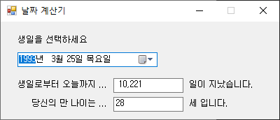

- DigitalClockApp

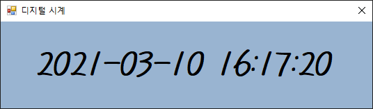

- ListboxApp

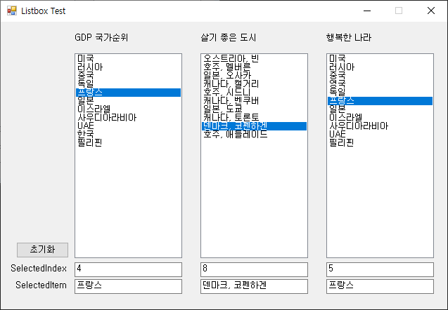

- ListViewApp

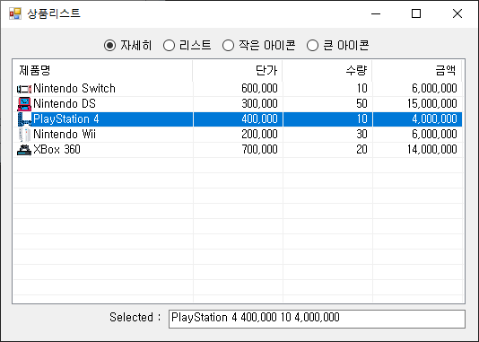

- MoviePlayerApp

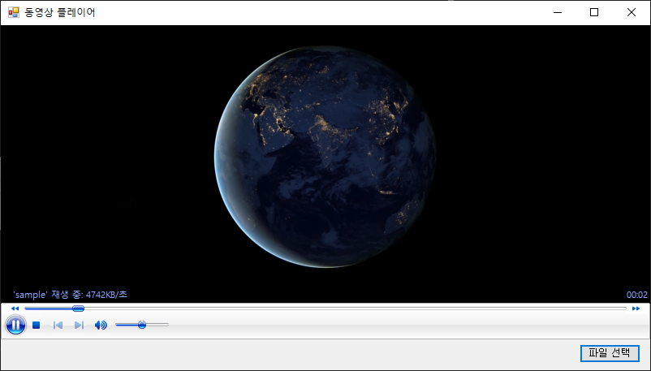

- RestaurentSelApp

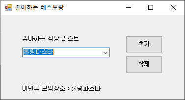

- SimpleGraphicEditorApp

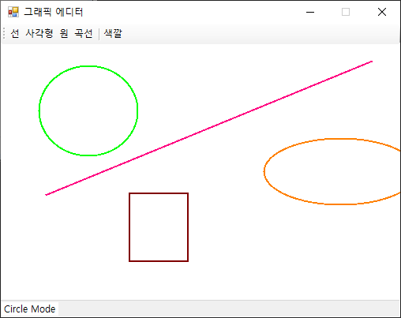

- StudyHistoryApp

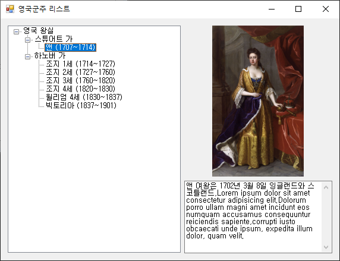

- TextViewerApp

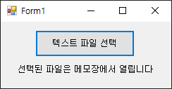

- TravelWishApp

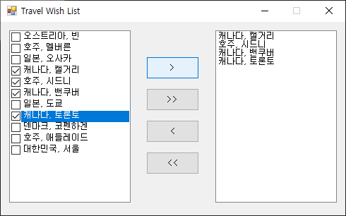

### 3. PracticeWinApp [Source](https://github.com/Kang0325/StudyDesktopApp/tree/main/WinformApp/PracticeWinApp)

- CheckBoxWinApp

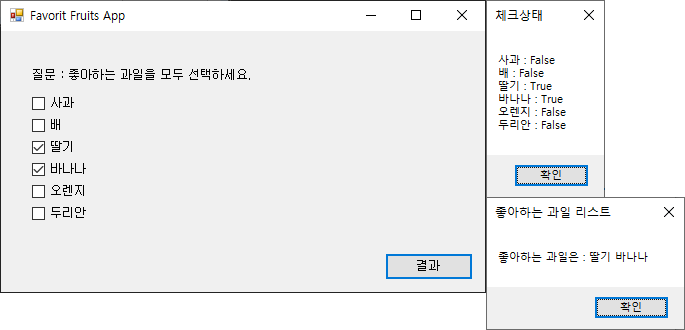

- ColorChangerApp

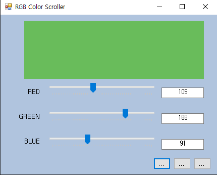

- FlgWinApp

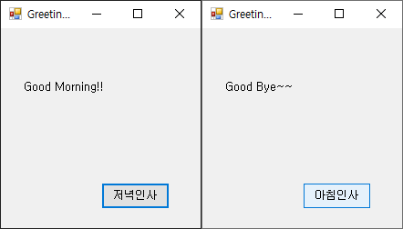

- LabelTestApp

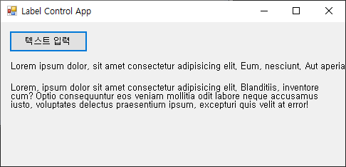

- LoginApp

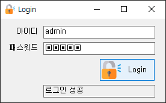

- MaskedTextApp

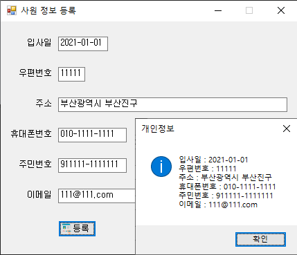

- PracticeWinApp

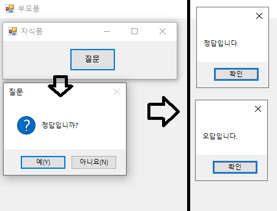

- RadioButtonWinApp

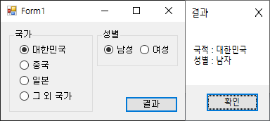

### 4. WinFormAdvancedBank [Source](https://github.com/Kang0325/StudyDesktopApp/tree/main/WinformApp/WinFormAdvancedBank)

- AddressInfoApp

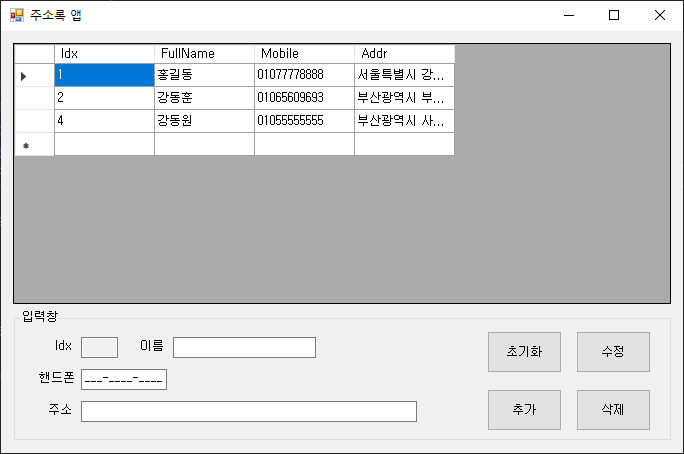

- BookRentalShopApp

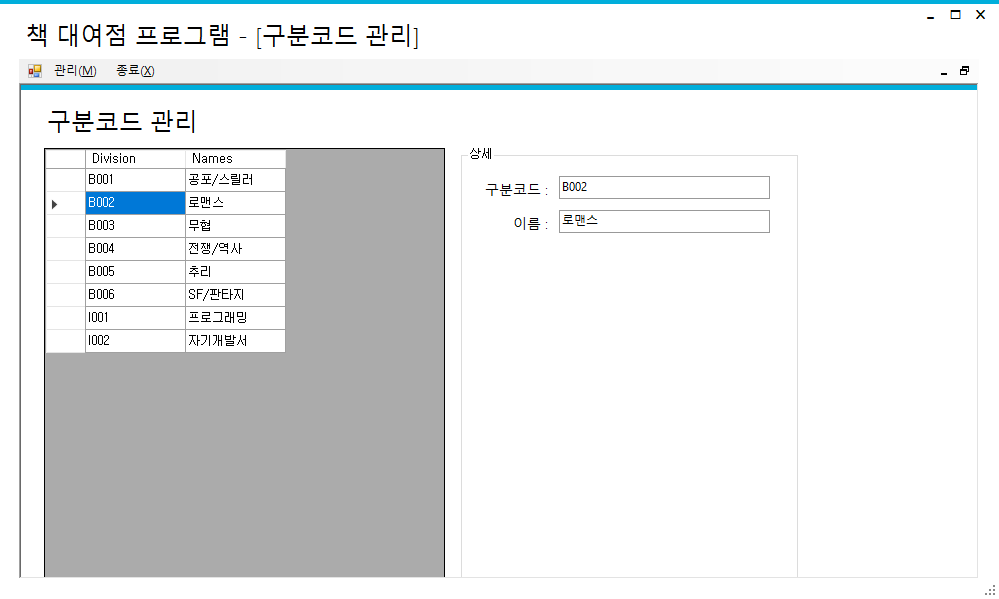

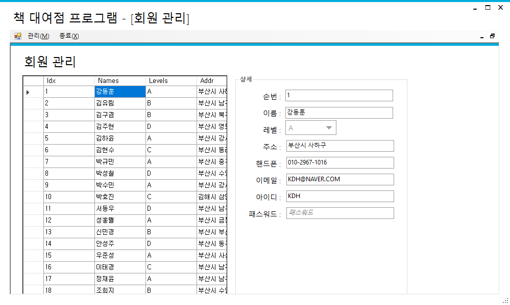

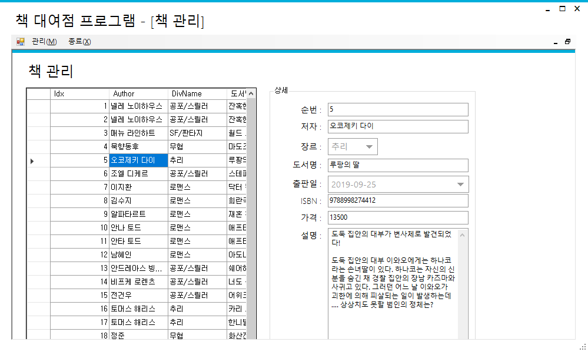

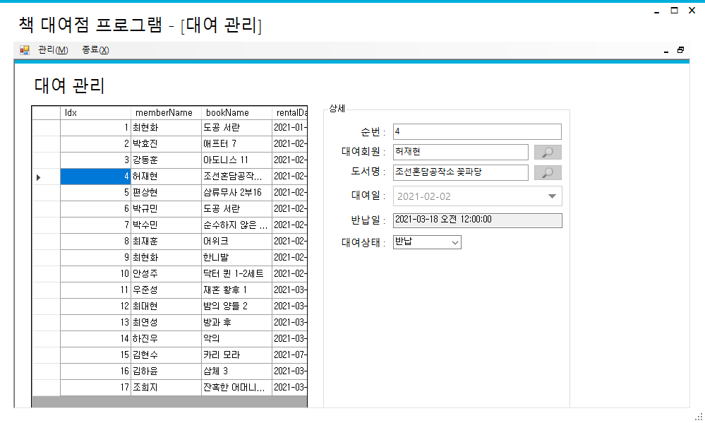

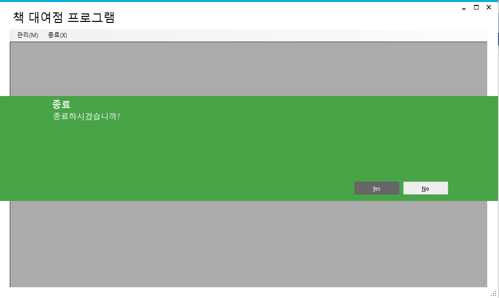

- ImageViewerApp

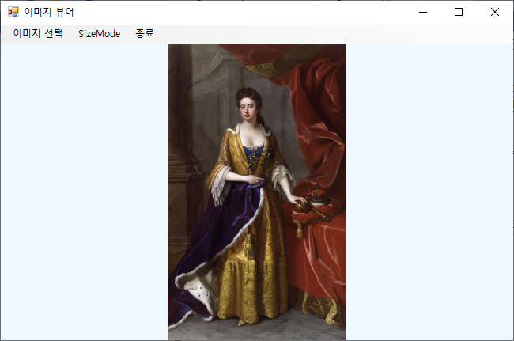

- IoTSensorMonApp

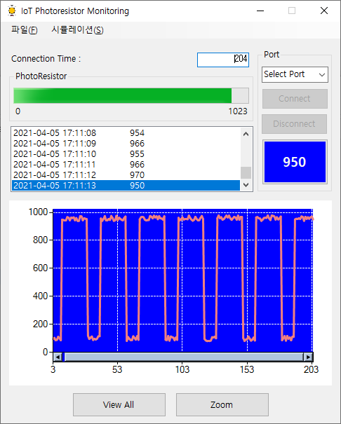

- WinChartApp

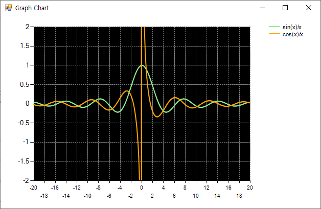

-----------------------------------------------------------------

## WPF

### 1. WpfExecutiveBank [Source](https://github.com/Kang0325/StudyDesktopApp/tree/main/WPFApp/WpfExecutiveBank)

- AnalogClockApp

- BlinkerApp

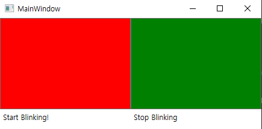

- BmiCalcApp

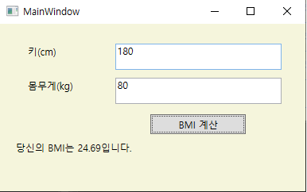

- CalculatorApp

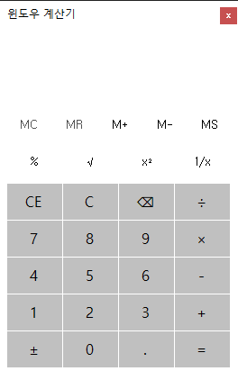

- HelloWpfApp

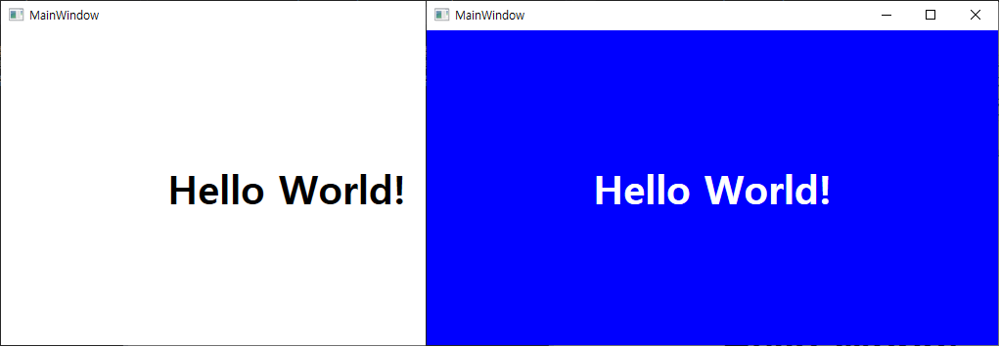

- MonteCarloPi

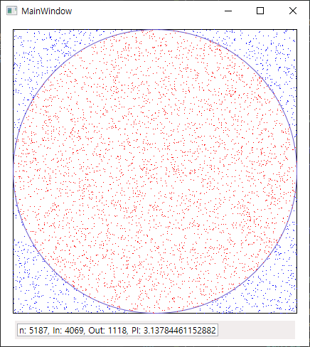

- SnakeBiteGameApp

- WpfCalculatorApp

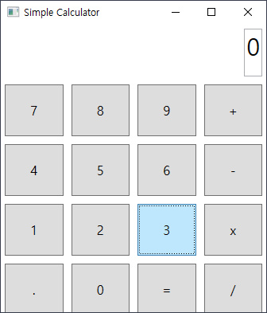

### 2. WpfAdvBank [Source](https://github.com/Kang0325/StudyDesktopApp/tree/main/WPFApp/WpfAdvBank)

