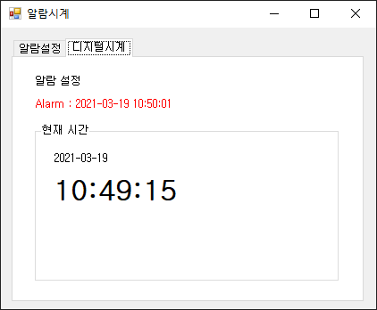
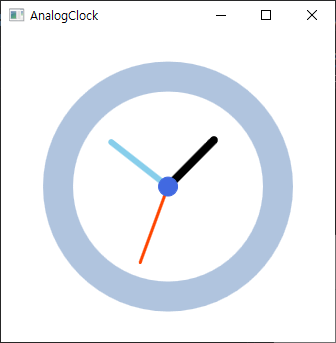
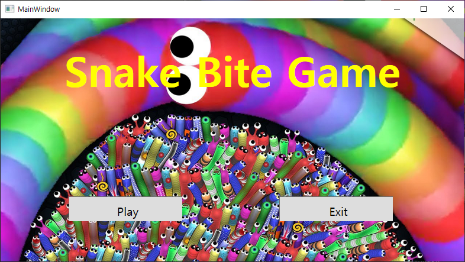

# StudyDesktopApp
PKNU C# 데스크톱 앱 개발 학습 리포지토리

----------------------------------------------------------------

## WinForm

### 1. ConfirmWinApp [Source](https://github.com/Kang0325/StudyDesktopApp/tree/main/WinformApp/ConfirmWinApp)

### 2. ExerciseWinApp [Source](https://github.com/Kang0325/StudyDesktopApp/tree/main/WinformApp/ExerciseWinApp)

- AlarmClockApp

- DateCalcApp

- DigitalClockApp

- ListboxApp

- ListViewApp

- MoviePlayerApp

- RestaurentSelApp

- SimpleGraphicEditorApp

- StudyHistoryApp

- TextViewerApp

- TravelWishApp

### 3. PracticeWinApp [Source](https://github.com/Kang0325/StudyDesktopApp/tree/main/WinformApp/PracticeWinApp)

- CheckBoxWinApp

- ColorChangerApp

- FlgWinApp

- LabelTestApp

- LoginApp

- MaskedTextApp

- PracticeWinApp

- RadioButtonWinApp

### 4. WinFormAdvancedBank [Source](https://github.com/Kang0325/StudyDesktopApp/tree/main/WinformApp/WinFormAdvancedBank)

- AddressInfoApp

- BookRentalShopApp

- ImageViewerApp

- IoTSensorMonApp

- WinChartApp

-----------------------------------------------------------------

## WPF

### 1. WpfExecutiveBank [Source](https://github.com/Kang0325/StudyDesktopApp/tree/main/WPFApp/WpfExecutiveBank)

- AnalogClockApp

- BlinkerApp

- BmiCalcApp

- CalculatorApp

- HelloWpfApp

- MonteCarloPi

- SnakeBiteGameApp

- WpfCalculatorApp

### 2. WpfAdvBank [Source](https://github.com/Kang0325/StudyDesktopApp/tree/main/WPFApp/WpfAdvBank)

